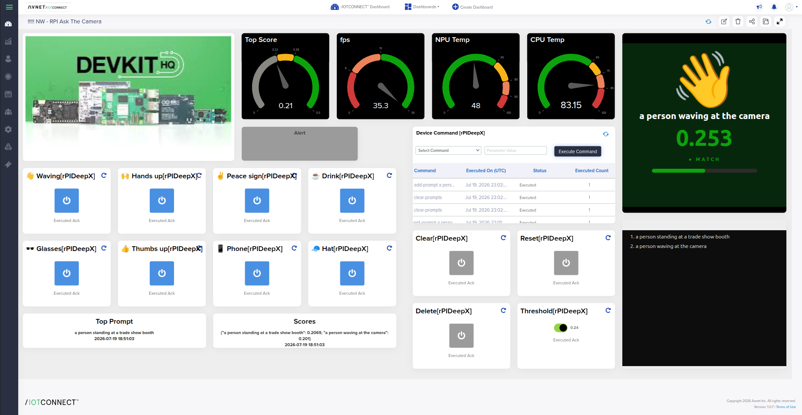

# "Ask the Camera" — CLIP Vision on DEEPX DX-M1 Quickstart

Cloud-reprogrammable AI vision on a Raspberry Pi 5 with the DEEPX DX-M1 NPU,
connected to Avnet /IOTCONNECT.

> [!IMPORTANT]
> This quickstart assumes the demo software is already installed on the board
> (DEEPX runtime, `dx_clip_demo`, and this bridge). For a full from-scratch
> install, see [DEMO.md](DEMO.md#appendix-full-installation).

## 1. Introduction

This demo runs the CLIP vision-language model on the DX-M1 NPU and scores the
live camera feed against plain-English prompts — *"a person waving"*, *"a red
toolbox"* — sent from the /IOTCONNECT dashboard. Prompt changes take effect in
about a second, with no retraining and no redeployment. Similarity scores, FPS,
and silicon temperatures stream to the cloud once per second.

## 2. Import the DXCLIP Template

The `DXCLIP` template must be present in your /IOTCONNECT instance.

1. Log into [console.iotconnect.io](https://console.iotconnect.io) and go to **Devices → Templates**.
2. If `DXCLIP` is already listed, skip to step 5.
3. Download [DXCLIP-template.json](DXCLIP-template.json).
4. Click **Create Template**, then **Import**, browse to the downloaded file, and **Save**.
5. Create (or edit) your device to use the `DXCLIP` template, then download the
   device's `iotcDeviceConfig.json` and certificate pair into this `bridge/`
   directory as `iotcDeviceConfig.json`, `device-cert.pem`, `device-pkey.pem`.

## 3. Set Up Hardware

- Raspberry Pi 5 (8 GB) with active cooler, DX-M1 on an M.2 HAT (2280 size), 27 W USB-C PSU.
- USB UVC camera (e.g., Logitech BRIO) positioned toward the demo area.
- HDMI display for the local annotated view (optional but great for booths).

## 4. Run

On the board (desktop terminal or SSH):

```bash
~/deepx/dx_clip_demo/bridge/run.sh
```

The OpenCV window opens on the local display, `[iotc] connected` confirms the
cloud link, and the booth web server starts on port 8080. If the device
credentials are missing the demo still runs fully — just offline.

## 5. Using the Demo

### Cloud commands (C2D)

| Command | Argument | Effect |
|---|---|---|
| `set-prompt` | text | Replace all prompts with this one |
| `add-prompt` | text | Append a prompt (stacks with existing) |
| `del-prompt` | — | Remove the most recently added prompt |
| `clear-prompts` | — | Remove all prompts |
| `set-threshold` | 0–1 | Alert threshold on `top_score` (start: 0.28; 0.24 for object prompts) |

### Telemetry (1 Hz)

| Attribute | Type | Description |
|---|---|---|
| `top_prompt` | string | Prompt with the highest similarity score |
| `top_score` | decimal | Its CLIP similarity (idle ≈ 0.18–0.23, match ≈ 0.28–0.35) |
| `scores` | string | JSON map of every prompt to its score |
| `fps` | decimal | End-to-end pipeline frame rate |
| `npu_temp` | decimal | DX-M1 temperature (°C) |
| `cpu_temp` | decimal | Pi 5 CPU temperature (°C) |
| `alert` | integer | 1 when `top_score` ≥ threshold |

### Local terminal

In the terminal running the demo: type a sentence to add a prompt, `list` to
show all prompts with scores, `del` to remove the last, `quit` to exit.

### Booth web pages (embed in dashboard widgets)

| URL | Contents |
|---|---|
| `http://<pi-ip>:8080/camera` | Annotated live camera feed |
| `http://<pi-ip>:8080/top` | Hero view: top prompt, giant score, match reveal |
| `http://<pi-ip>:8080/prompts` | Numbered list of loaded prompts |
| `http://<pi-ip>:8080/` | Combined view |
| `http://<pi-ip>:8080/state.json` | Raw JSON state |

> [!TIP]
> The dashboard is HTTPS; allow mixed content for the dashboard origin in the
> booth browser (padlock → Site settings → Insecure content: Allow), and give
> the Pi a DHCP reservation so the widget URLs stay stable.

## 6. Dashboard

A full dashboard combines the gauges, prompt command buttons, and the board's
embedded live pages:



## 7. Suggested Gauge Ranges

| Gauge | Range | Green | Amber | Red |
|---|---|---|---|---|
| `top_score` | 0–0.5 | ≥ 0.28 (`#0ca30c`) | 0.22–0.28 (`#fab219`) | — (below = gray `#898781`) |
| `fps` | 0–30 | ≥ 15 | 8–15 (`#ec835a`) | < 8 (`#d03b3b`) |
| `npu_temp` | 0–100 | < 65 | 65–80 | > 80 |
| `cpu_temp` | 0–100 | < 65 | 65–75 | > 75 (throttles at 85) |
